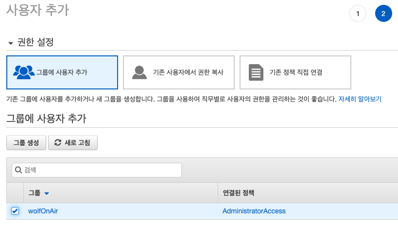
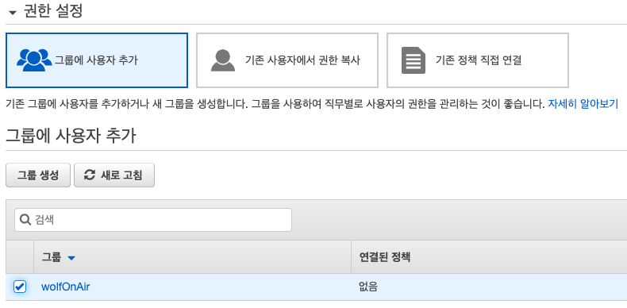
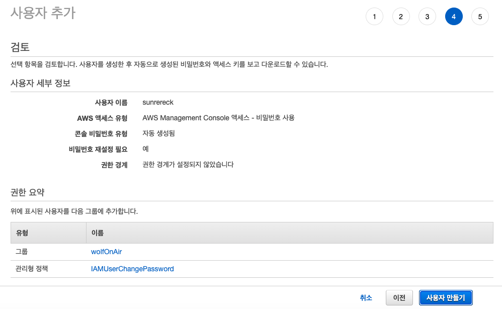
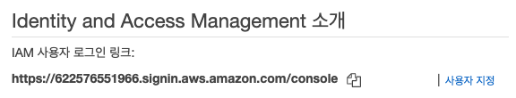
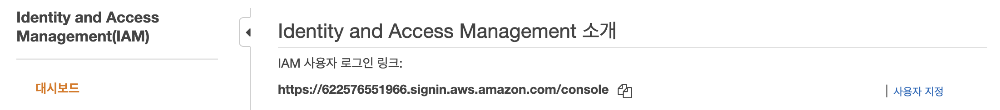
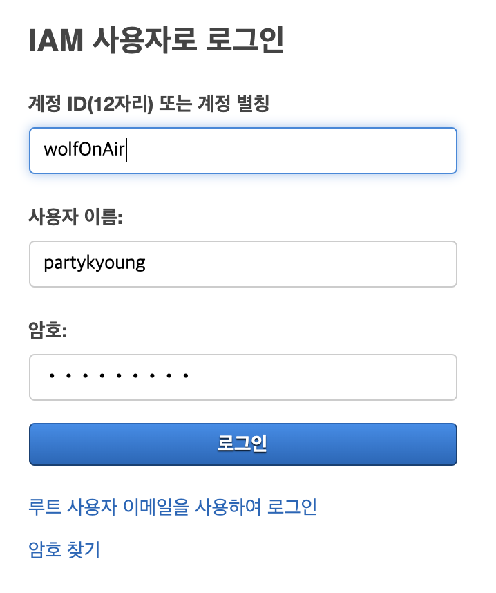
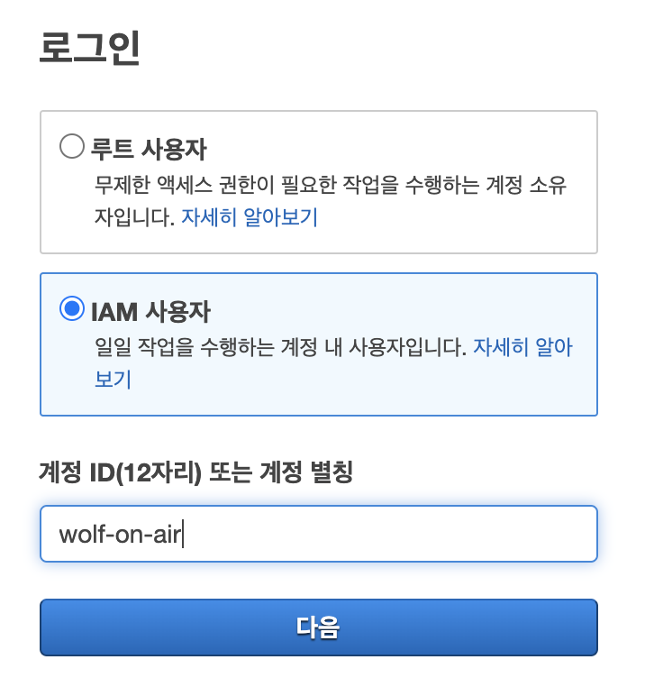
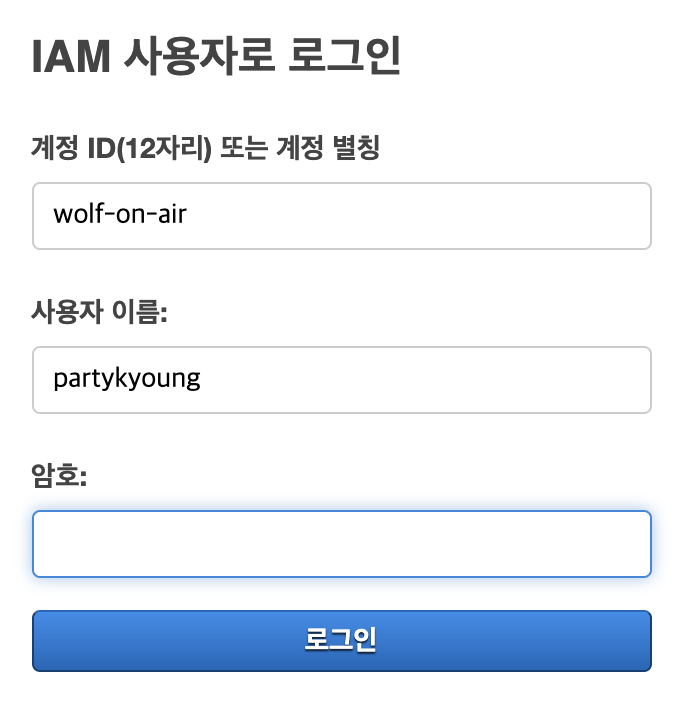

## AWS IAM

- AWS 리소스에 대한 액세스를 안전하게 제어할 수 있는 웹 서비스.
- AWS 계정 안에 IAM 그룹과 사용자를 생성하여 접근제어 및 권한관리를 세분화 할 수 있다.
  - 일부 EC2 인스턴스를 관리할 수 있는 권한을 주거나, 일부 S3 버킷에 대한 읽기 전용 권한만 주는 등 리소스에 따라 여러 사람에게 다양한 권한을 부여할 수 있다.
  - IAM 사용자에게 전체 권한이 아닌 필요한 권한만 허용하기 때문에 보안성이 높아진다.
- IAM을 사용할 때는 리전을 선택할 필요가 없다.

## Root 사용자와 IAM 사용자

AWS 계정을 처음 생성하면 완전한 엑세스 권한이 있는 SSO(single Sign-In, 단일 사용자) ID로 시작하는데 이것을 Root 사용자라고 한다. Root 사용자는 계정을 생성할 때 사용한 이메일 주소와 암호로 로그인하여 액세스 한다.
AWS에서는 Root 사용자는 무제한적인 액세스 권한이 있으니 [Root 사용자로만 가능한 작업](https://docs.aws.amazon.com/ko_kr/general/latest/gr/aws_tasks-that-require-root.html)을 할 때를 제외하고는 Root 사용자 보다는 IAM 사용자를 사용하기를 권장하고 있다.

- Root 사용자를 여려명이 공유해서 사용하는 경우 누가 어떤 작업을 했는지 구분하는 것이 불가능하다.
  - 이럴 경우 여러명의 작업자가 각각 다른 API 호출을 해도 [AWS CloudTrail](https://docs.aws.amazon.com/ko_kr/awscloudtrail/latest/userguide/cloudtrail-user-guide.html)에는 Root 사용자의 기록으로 남기 때문에 추후에 로그 확인이나 추적이 힘들어진다.
- Root 사용자 계정이 해킹당하면 모든 AWS 액세스 권한이 해킹되는 것이나 마찬가지 이다. 
  - 만약 IAM 사용자가 해킹당하면 해당 IAM 사용자만 차단하고 AWS CloudTrail 로그를 확인하여 피해를 최소화 할 수 있다.
  - 실제로 AWS 계정이 해킹당해 요금이 엄청나게 나왔다는 사례가 왕왕 있다.
- Root 사용자의 액세스 키가 유출된 경우 액세스 키를 삭제하는 것 이외에는 대응할 수 있는 방법이 없다.
  - 이 액세스 키가 현재 실제 운영되고 있는 서비스에서 사용하고 있는 키라면 무작정 삭제했을 때 서비스에 장애가 생길 수도 있다.
  - IAM 사용자에게 발급된 액세스 키는 권한을 제어하는 것이 가능하며, 삭제나 재발급에 대한 부담이 적다.

### IAM 사용자 추가하기

AWS 리소스 권한을 가진 IAM 사용자를 추가해보자.

Root 사용자로 로그인 한 후 검색창에서 IAM을 입력하거나 서비스 메뉴 목록에서 IAM을 클릭하여 IAM 대시보드 창으로 이동한다.

사용자 항목을 클릭하여 IAM 사용자 페이지에 접속한다.

사용자 추가 버튼을 클릭한다.

추가할 사용자의 이름과 액세스 유형을 설정한다. 액세스 유형은 프로그래밍 방식 액세스와 AWS Management Console 액세스가 있으며 나중에 변경이 가능하다. 프로그래밍 방식 액세스는 
AWS S3에 정적호스팅을 하거나 Serverless 프레임워크를 통해 AWS Lambda에 작업한 것을 배포하는 등 필요한 작업에 권한을 설정하기 위해 액세스 키를 생성하는 방식이고 AWS Managemet Console 액세스는 로그인 가능한 사용자를 생성하는 방식이다.
나는 AWS를 관리할 사용자가 필요하므로 AWS Management Console 액세스를 선택했다.

이제 사용자의 권한을 설정해야 한다. 권한 설정에는 그룹에 사용자 추가, 기존 사용자에서 권한 복사, 기존 정책 직접 연결이 있다.
나는 기존에 생성해놨던 그룹도 있고 다른 방법들은 어떻게 설정하는지 잘 몰라서 무난하게 그룹에 사용자 추가 방법으로 권한을 설정했다.

만약 그룹이 없거나 다른 권한의 그룹이 필요하다면 그룹생성 버튼을 눌러 생성할 수 있다.
AdministratorAccess 권한은 AWS의 모든 서비스 및 리소스에 대한 엑세스 및 권한을 허용한다. 이 권한을 선택하면 Root 사용자와 같은 권한을 IAM 사용자에게 주는거나 마찬가지이기 때문에 주의가 필요하다. 왠만하면 최소한의 권한을 부여하도록 하자.

태그를 사용하여 IAM 사용자 지정 속성을 추가할 수 있다. 요 부분은 나도 잘 모르는데다가 굳이 입력을 안해도 되기 때문에 그냥 패스했다.

마지막으로 잘못된 부분이 있는지 한번더 확인을 한 후 사용자 만들기 버튼을 누르면 IAM 사용자가 생성된다.

비밀번호 항목에서 표시 버튼을 눌러 사용자의 비밀번호를 확인할 수 있다. 이 비밀번호로 로그인을 해야 하니 잘 기억해두자.

IAM 사용자가 로그인 하려면 계정 ID 또는 별칭을 알고 있어야 한다. 슛자로 된 ID 보다는 별칭이 좀 더 익히기 쉬우므로 사용자 지정 버튼을 눌러 계정 별칭을 생성해 주자. 필수가 아니기 때문에 안해도 된다.

원하는 별칭을 입력하고 생성 버튼을 눌러주면 이제 계정 별칭을 이용해서 로그인도 가능해진다.

### IAM 사용자 로그인

IAM 사용자를 생성했으니 이제 로그인을 해보자.

Root 사용자 로그아웃을 한 후에 로그인 페이지로 가서 IAM 사용자를 선택하고 계정 ID나 별칭을 입력해준다.

방금 생성한 IAM 사용자를 입력하고 사용자를 생성했을 때 확인한 비밀번호를 같이 입력해준다.

로그인이 성공적으로 완료되었으면 비밀번호 변경 창이 뜬다. 원하는 비밀번호를 입력한후 확인 버튼을 눌러준다.

이렇게 IAM 사용자 생성이 완료 되었다. 앞으로 AWS에 접속할 일이 있을 땐 요 IAM 계정을 사용하면 된다. 추가로 같이 작업하고 싶은 동료가 있으면 위의 과정을 거쳐 IAM 사용자를 추가해주면 된다.

## 마무리

IAM 대시보드 창에 접속하면 현재 IAM 보안 상태를 확인할 수 있다. 이 보안 상태 항목들은 필수로 조치해야 할 항목들은 아니나 AWS를 좀 더 안전하게 사용하려면 조치를 취해두는게 좋다.
IAM 사용자 생성및 그룹 생성은 이미 해놨기 때문에 완료 표시가 뜨는건 알겠는데 루트 액세스 키 삭제는 뭘 딱히 안했는데 왜 뜨는지 모르겠다. 예전에 Serverless를 사용하려고 프로그래밍 액세스 방식으로 IAM 액세스 키를 발급받은 적이 있는데 이거 떄문인거 같기도 하고... 이 부분은 나중에 좀 더 공부를 한 후에 정리를 해봐야겠다.

## Reference

> - [IAM이란?](https://docs.aws.amazon.com/ko_kr/IAM/latest/UserGuide/introduction.html)
> - [[초보자를 위한 AWS 웹구축] 2. IAM 유저 및 MFA 생성하기](https://tech.cloud.nongshim.co.kr/2018/10/11/%EC%B4%88%EB%B3%B4%EC%9E%90%EB%A5%BC-%EC%9C%84%ED%95%9C-aws-%EC%9B%B9%EA%B5%AC%EC%B6%95-2-iam-%EC%9C%A0%EC%A0%80-%EC%83%9D%EC%84%B1%ED%95%98%EA%B8%B0/)
> - [아마존 웹 서비스 계정 생성 후 해야하는 IAM 보안 조치](https://www.44bits.io/ko/post/first_actions_for_setting_secure_account#%EB%A3%A8%ED%8A%B8-%EC%82%AC%EC%9A%A9%EC%9E%90%EC%9D%98-%EC%95%A1%EC%84%B8%EC%8A%A4-%ED%82%A4-%EC%82%AD%EC%A0%9C)
