IAM 대시보드 창에 접속하면 IAM 보안 상태를 확인할 수 있다. 좀 더 안전한 AWS 사용을 위해 각각 보안 항목들을 설정해보자.

## 루트 액세스 키 삭제
AWS CLI, PowerShell용 도구, AWS SDK 또는 직접 AWS API 호출을 할 때 액세스 키를 사용한다. Root 사용자의 액세스 키는 모든 리소스에 무제한적으로 접근할 수 있기 때문에 사용하지 않는것이 안전하다. 

루트 액세스 키는 AWS 계정을 생성할 때 자동으로 생성되지 않기 때문에 이 항목에서 해줘야 할 작업은 없다.

## 루트 계정에서 MFA 활성화
루트 계정에서 MFA(Multi-factor authentication, 다중 요소 인증)활성화는 Root 사용자 로그인에 OTP(One-Time Password, 일회용 비밀번호) 인증을 더하는 것 이다. Root 사용자 로그인 시 일회용 비밀번호를 입력해야 로그인이 가능하다.

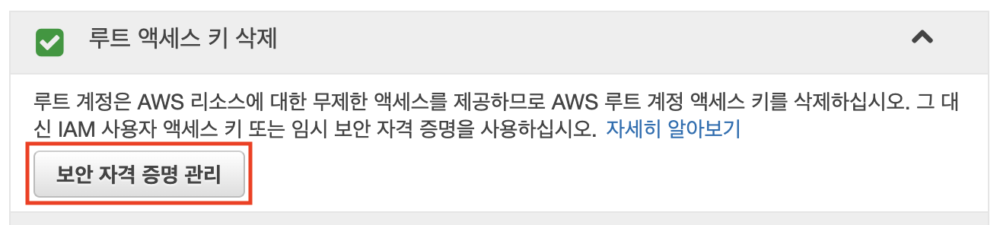

MFA를 활성화 하려면 보안 상태 항목에서 MFA 활성화 항목을 선택한 후 MFA 관리 버튼을 클릭하여 보안 자격 증명 화면으로 이동한다.

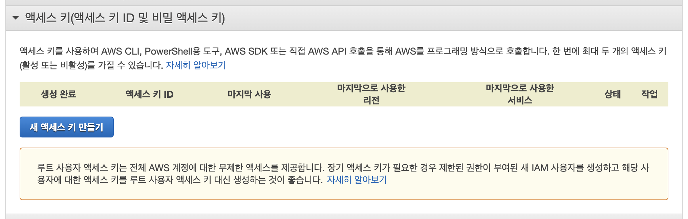

멀티 팩터 인증(MFA) 항목을 선택하여 MFA 활성화 버튼을 클릭한다.

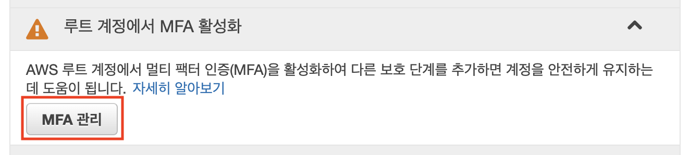

MFA 디바이스 관리 항목에서 원하는 MFA 디바이스 유형을 선택한다.

가상 MFA 디바이스 유형은 가상 디바이스로 OTP를 발급받아 인증하는 방식이다. 가상 디바이스를 스마트폰으로 사용하는 경우 AWS에서 공식지원하는 OTP 생성어플을 사용하면 된다. 대표적인 예로 Google Authenticator가 있다. 

[U2F 보안 키](https://www.amazon.com/stores/page/8E6D7A52-6F69-4A70-A07B-4168A9FD33B0?ingress=0&visitId=4e887182-a088-465f-a4b3-b9f1b06da6a1&channel=SLP_FW_21D9BC02-6DFF-4BD7-A77F-4AE207A2AEFD&liveVideoDataUrl=https://amazonlive-portal.amazon.com/v2)는 컴퓨터의 USB 포트에 연결하는 디바이스 이다.

[하드웨어 MFA 디바이스](https://www.amazon.com/SafeNet-IDProve-Time-based-6-Digit-Services/dp/B002CRN5X8?ie=UTF8&keywords=gemalto%20aws&qid=1462806259&ref_=sr_1_1&sr=8-1)는 은행애서 사용하는 OTP 발생기 같은 하드웨어를 사용하여 인증을 하는 것이다. 역시 AWS에서 공식지원하는 하드웨어를 사용해야 한다. 대표적인 예로 Gemalto에서 만든 OTP 생성기가 있다. 

원하는 유형을 선택하고 계속 버튼을 누르면 된다. 나는 추가 장비를 구매해야 하는 U2F 보안 키, 하드웨어 MFA 디바이스 유형보다는 스마트폰만 있으면 손쉽게 인증할 수 있는 가상 MFA 디바이스 방식을 선택했다.

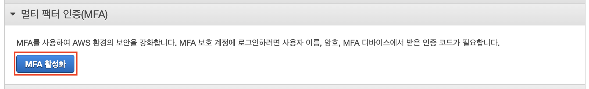

QR 코드 보기를 눌러 QR 코드를 화면에 띄웠다.

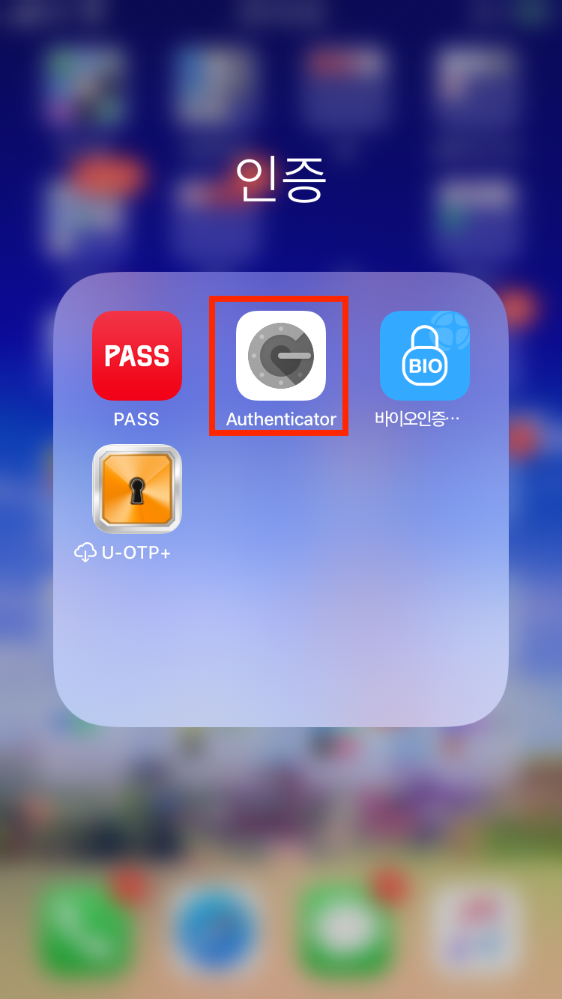

몇번 사용해본 적이 있어서 익숙한 Google Authenticator 어플로 OTP 인증을 받기로 했다.

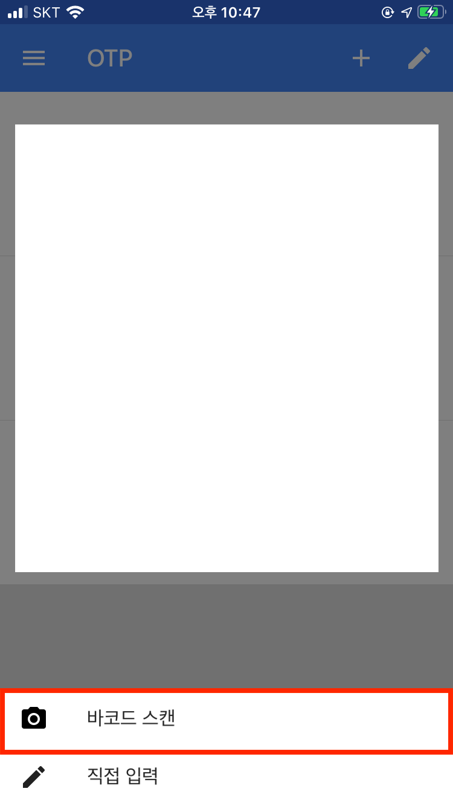

+ 버튼을 누른후 출력된 다이얼로그에서 바코드 스캔을 선택하여 QR 코드를 찍어주면 AWS OTP가 OTP 목록에 추가된다.
생성된 6자리 숫자를 MFA 코드 1 항목에 입력한 후 30초가 지난 후 바로 생성된 6자리 숫자를 MFA 코드 2 항목에 넣어준다.

MFA 코드 1, MFA 코드 2 항목을 다 넣고 MFA 활성화 버튼을 클릭하면 MFA 활성화가 완료된다.

이제 Root 사용자로 로그인을 시도하면 MFA 코드 입력창이 추가로 뜬다. 이 코드 역시 Google Authenticator에서 생성된 6자리 숫자를 입력하면 된다.

## 개별 IAM 사용자 생성

## 그룹을 사용하여 권한 할당

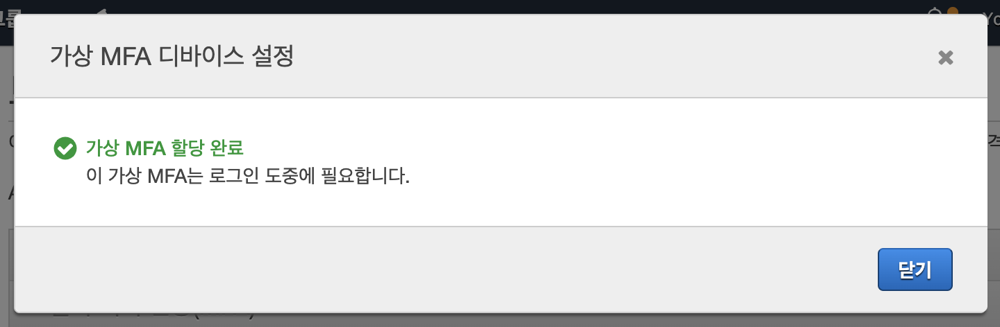
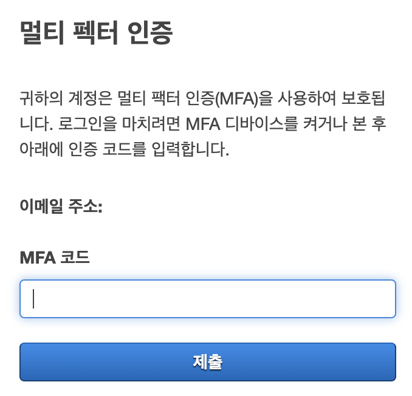
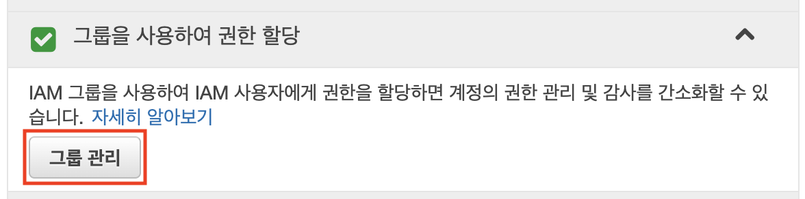

## IAM 비밀번호 정책 적용
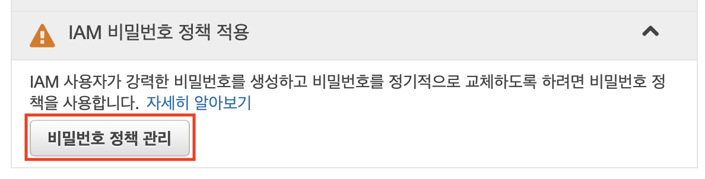
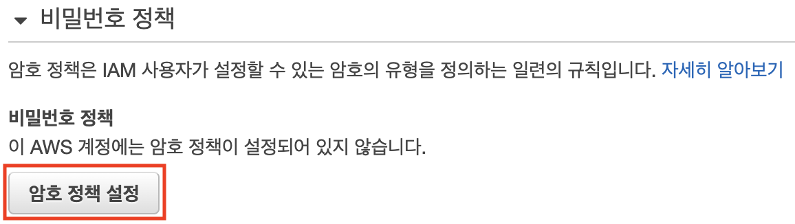

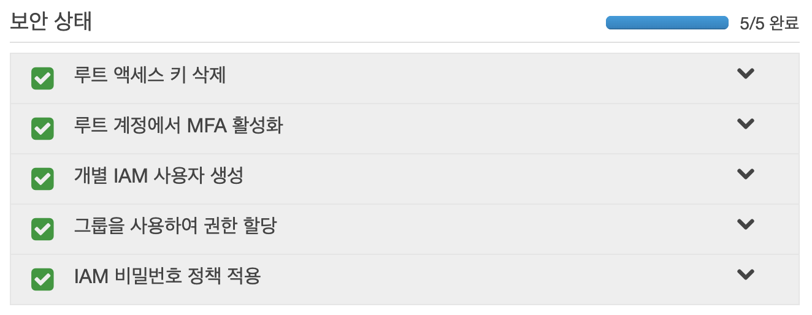
## Reference
> - [AWS 액세스 키 관리를 위한 모범 사례](https://docs.aws.amazon.com/ko_kr/general/latest/gr/aws-access-keys-best-practices.html)
> - 
> - [아마존 웹 서비스 계정 생성 후 해야하는 IAM 보안 조치](https://www.44bits.io/ko/post/first_actions_for_setting_secure_account#%EB%A3%A8%ED%8A%B8-%EC%82%AC%EC%9A%A9%EC%9E%90%EC%9D%98-%EC%95%A1%EC%84%B8%EC%8A%A4-%ED%82%A4-%EC%82%AD%EC%A0%9C)
