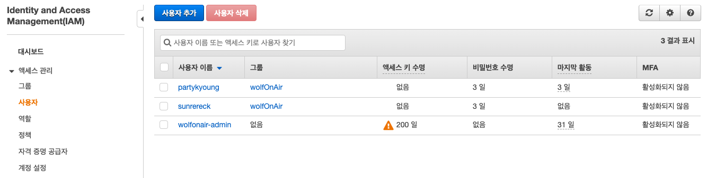
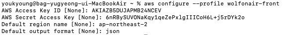
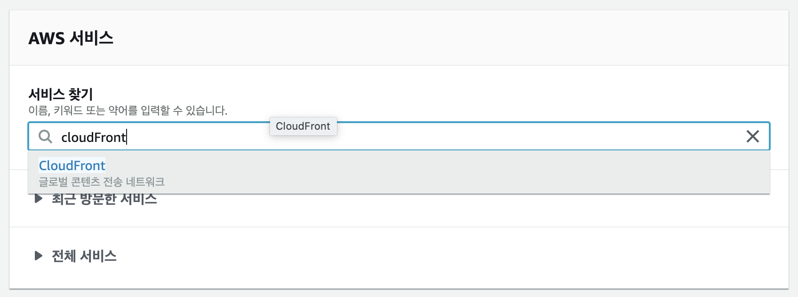
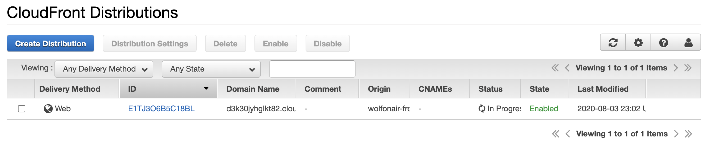

## AWS S3

[AWS S3(Simple Storage Service)](https://aws.amazon.com/ko/s3/)는 인터넷상 어디서나 원하는 양의 데이터를 저장하고 검색할 수 있도록 구축된 객체 스토리지 서비스이다. 확장성과 가용성이 뛰어나며 모든 S3 객체의 복사본을 자동으로 생성하고 저장하기 때문에 높은 내구성을 보장한다. 사용한 스토리지 만큼 요금이 청구된다.

### 객체

- S3에 저장되는 기본 개체.
- S3에 저장된 데이터 하나하나를 객체라고 명명한다.
- 데이터와 키, 메타데이터로 구성된다.
  - 키는 객체에 지정한 이름이다. 버킷 내 객체를 고유하게 식별하며 키를 사용하여 객체를 검색한다.
  - 메타데이터는 객체를 설명하는 이름-값 페어의 집합이다.

### 버킷

- S3에 저장된 객체에 대한 컨테이너.
  - 객체가 파일이라면 버킷은 연관된 객체들을 그룹핑한 최상위 디렉토리라고 할 수 있다.
- 모든 객체는 버킷에 포함된다.
- S3에 데이터를 업로드하려면 우선 하나의 AWS 리전에 S3 버킷을 만들어야 한다.
- 버킷에 포함된 모든 객체에 대해서 일괄적으로 인증과 접속 제한을 걸 수 있다.

## AWS S3로 정적 웹사이트 호스팅 하기

S3는 단순히 데이터 저장 뿐만 아니라 여러가지 부가 기능을 제공한다. 그 중 하나가 정적 웹사이트 호스팅이다.

S3에 버킷을 생성한 후 해당 버킷을 웹 사이트 호스팅용로 구성한 후 HTML, css, JavaScript 파일 같은 웹 사이트 콘텐츠를 버킷에 업로드하면 S3로 정적 웹 사이트를 호스팅할 수 있다.

토이 프로젝트로 작업하고 있는 React 프로젝트가 있는데 이것을 S3에 한번 태워보자.

### IAM 권한 추가

React 프로젝트를 빌드 한후 s3에 접속하여 웹 호스팅용 버킷에 직접 웹 사이트 콘텐츠들을 직접 업로드 해도 되지만 AWS CLI를 사용하여 스크립트 만으로 간단하게 빌드 및 배포를 완료할 수 있다.

AWS CLI로 작업을 하기 위해선 AWS CLI에 액세스 할 수 있도록 IAM 권한이 필요하다. 그래서 IAM 권한 설정을 먼저 해주기로 했다.


먼저 AWS 서비스 검색창에서 IAM을 검색하거나 서비스 메뉴에서 IAM 항목을 찾아 클릭하여 IAM 대시보드 창으로 이동한다.



IAM 대시보드 메뉴에서 사용자 항목을 클릭한 후 사용자 추가 버튼을 클릭한다.


사용자 이름을 입력한 후 액세스 유형으로 프로그래밍 방식 액세스를 선택한다. 액세스키만 필요하기 때문에 프로그래밍 방식 액세스를 선택하면 된다.


기존 정책 직접 연결 항목을 선택한 후 S3를 검색하여 AmazonS3FullAccess 권한을 선택해준다. AmazonS3FullAccess 권한은 S3에 관한 모든 사용권한을 부여한다.

권한 설정이 완료 되었으면 다음 버튼을 눌러준다.


태그 추가는 필수가 아니므로 그냥 넘어가도 된다.


마지막으로 제대로 이름을 입력하고 권한을 부여했는지 한번 더 검토한 후 사용자 버튼을 클릭한다.


IAM 사용자 추가가 완료 되었다. 액세스 키 ID와 비밀 액세스 키는 AWS CLI 설정 시 꼭 필요하기 때문에 csv 다운로드로 파일을 저장해놓거나 어딘가에 기록해놓자. 비밀 액세스 키는 절대로 외부에 노출되면 안된다.

### AWS CLI 설정

이제 AWS CLI 설치 및 설정이 필요하다. AWS CLI는 [AWS 설치메뉴얼 문서](https://docs.aws.amazon.com/ko_kr/cli/latest/userguide/install-cliv2.html)에서 설치할 수 있다.

```
aws configure --profile IAM 사용자 이름
```

설치가 완료 되면 해당 명령어를 터미널에 입력하여 CLI를 통하여 IAM 사용자를 추가 해준다.



AWS Access Key ID와 AWS Secret Access Key는 IAM 사용자 생성 후 얻은 액세스 키 ID와 비밀 액세스 키를 입력하면 된다.

Default region name에는 원하는 리전을 적어주면 된다. AP-NORTHEAST-2는 아시아-태평양 서울 리전이다.

여기 까지 하면 IAM 권한 설정까지 완료 되었다.

### AWS S3 버킷 생성

이제 웹 호스팅용 S3 버킷을 생성해야 한다.


AWS 서비스 메뉴에서 S3를 검색하여 S3 메뉴로 이동한다.


버킷 만들기 버튼을 클릭한다.


버킷 이름을 선택해준다. 리전은 기본으로 아시아 태평양(서울)로 되어있는데 원하면 바꿔도 된다.


기본 설정으로 정적 웹 호스팅 환경을 구성할 수 있기 때문에 아무것도 건들지 않고 다음으로 넘어간다.


기본적으로 Amazon S3은 계정 및 버킷에 대한 퍼블릭 액세스를 차단한다. 하지만 정적 웹 호스팅 환경을 구성하기 위해서는 요 퍼블릭 차단 설정을 해제 해주어야 한다. 모든 퍼블릭 액세스 차단 체크박스를 해제 하고 다음을 눌러준다.


마지막으로 실수한 부분이 있는지 검토를 마친 후 버킷 만들기 버튼을 클릭하면 버킷 생성이 완료 된다.


S3 버킷 목록으로 돌아오면 방금 생성한 버킷이 보인다. 이 버킷 항목을 눌러 버킷 설정 화면으로 이동한다.


권한 탭을 클릭한 후 버킷 정책 항목을 클릭한다.


```
{
  "Version":"2012-10-17",
  "Statement":[
    {
      "Sid":"PublicReadGetObject",
      "Effect":"Allow",
      "Principal": "*",
      "Action":["s3:GetObject"],
      "Resource":["arn:aws:s3:::버킷 이름/*"]
    }
  ]
}
```

웹 사이트에 대한 퍼블릭 읽기 액세스 권한을 부여하기 위해 위의 버킷 정책을 복사한 후 버킷 정책 편집기에 붙여 넣은 후 저장을 눌러준다. Resource에는 버킷 이름을 입력해야 한다.


속성 탭을 선택한 후 정적 웹사이트 호스팅 항목을 클릭한다.


S3에 업로드 하려는 웹 콘텐츠 파일들이 React로 작업한 SPA 구조를 가지고 있기 때문에 인덱스 문서와 오류 문서에 index.html을 입력해준다.

SPA는 최초 요청에서 index.html을 받은 후 js, css 등 필요한 파일들을 로드하여 앱을 초기화 한다. 때문에 인덱스 주소(/)로 접속한 후 다른 페이지로 이동하면 문제가 없으나 하위 url을 복사해서 접속하거나 인덱스 페이지에서 다른 페이지로 이동 후 새로고침을 하면 해당 url에 맞는 html파일을 찾을 수 없기 때문에 404 페이지가 나오게 된다. 이 문제를 해결하려면 하위 url로 접근해도 index.html을 반환하도록 하게 하면 된다. 그래서 오류 문서에도 index.html을 입력하는 것이다.

### 배포

AWS CLI 설정과 S3 설정이 완료 되었으므로 이제 배포를 하면 된다.

```json
  "scripts": {
    "start": "node scripts/start.js",
    "build": "node scripts/build.js",
    "test": "node scripts/test.js",
    "deploy": "aws s3 sync ./build s3://버킷 이름 --profile=IAM 이름"
  },
```

좀 더 편한 배포를 위해 package.json 파일의 scripts 부분에 deploy 명령어를 추가한다.

```
yarn build && yarn deploy
```

이제 프로젝트 빌드 후 deploy 명령어로 배포까지 한 후 엔드포인트로 접속해보면 정상적으로 페이지가 뜨는 것을 확인할 수 있다.

### CloudFront 설정하기

AWS CloudFront란 .html, .css, .js 및 이미지 파일과 같은 정적 및 동적 웹 콘텐츠를 사용자에게 더 빨리 배포하도록 지원하는 CDN 서비스이다.

S3로 구축한 정적 웹 사이트에 HTTPS를 사용하려면 CloudFront를 사용해야 한다. HTTPS 지원 뿐만 아니라 CloudFront를 사용하면 커스텀 도메인 사용도 가능하며 S3에 직접 액세스 하는 것 보다 요금도 저렴하다.



AWS 서비스 메뉴에서 CloudFront를 검색하여 CloudFront 메뉴로 이동한다.


Create Distribution 버튼을 클릭한다.


Web 부분에 있는 Get Started 버튼을 클릭한다.


Origion Domain Name 항목의 input 박스를 클릭하면 방금 만든 S3 버킷이 나타난다. 해당 S3 항목을 선택한다.

Viewer Protocol Policy 항목에서는 Redirect Http to Https 를 선택하고 화면을 쭉 내려서 Create Distribution을 클릭한다.



완료 후 다시 CloudFront Distribition 목록으로 돌아오면 방금 생성한 CloudFront가 보인다.

CloudFront로 파일을 배포하면 S3에서 파일을 업데이트 해도 캐시가 남아있기 떄문에 업데이트 이전의 파일을 보여준다. 캐시 유지 시간이 24시이기 때문에 파일을 업데이트 한후 24시간 이후에 업데이트 한 파일이 적용된다. 
캐시 시간에 상관없이 강제로 파일을 업데이트 하고 싶으면 Invaldiation 작업이 필요하다. 배포할 때 파일도 강제로 업데이트 할 수 있도록 작업을 해보자.


IAM 항목으로 가서 첫번쨰 단계에 만들었던 IAM 사용자에 CloudFrontFullAccess 권한을 추가해야한다.

```json
  "scripts": {
    "start": "node scripts/start.js",
    "build": "node scripts/build.js",
    "test": "node scripts/test.js",
    "deploy": "aws s3 sync ./build s3://버킷 이름 --profile=IAM 이름",
    "invalidate": "aws cloudfront create-invalidation --profile=위에서 생성한 iam 사용자 이름--distribution-id 위에서 생성한 ColudFront distribution Id --paths / /index.html /error.html /service-worker.js /manifest.json /favicon.ico"
  },
```

s3에 배포한 React 프로젝트의 package.json 파일의 scripts 항목에 invalidate 명령어를 추가 해준다.

```
yarn build && yarn deploy && yarn invalidate
```

이제 배포할 때 invalidate 명령어를 사용해주면 된다.

## 마무리
S3에 React 프로젝트를 업로드 하여 정적 웹 호스팅을 하고 CloudFront 까지 적용해봤다. 정적 웹 호스팅 작업을 하면서 일단은 인덱스 문서, 오류 문서에 둘다 index.html을 적용하는 방식으로 작업을 했는데 왠만하면 오류 문서는 에러 처리 파일로 대체하는것이 나을 것 같다. 나중에 시간 나면 이 방법도 한번 찾아봐야겠다.

## Reference

> - [Amazon S3](https://aws.amazon.com/ko/s3/)
> - [Amazon S3이란 무엇입니까?](https://docs.aws.amazon.com/ko_kr/AmazonS3/latest/dev/Welcome.html)
> - [아마존 S3(S3, Amazon Simple Storage Service)](https://www.44bits.io/ko/keyword/amazon-web-service#%EC%95%84%EB%A7%88%EC%A1%B4-s3s3-amazon-simple-storage-service)
> - [Simple Storage Service(S3)](https://opentutorials.org/course/608/3006)
> - [Amazon S3 정적 웹 사이트 호스팅](https://docs.aws.amazon.com/ko_kr/AmazonS3/latest/dev/WebsiteHosting.html)
> - [리액트 앱 AWS S3, CloudFront 에 배포하기](https://react-etc.vlpt.us/08.deploy-s3.html)
> - [pushState를 사용하는 SPA를 S3와 CloudFront로 서비스하기](https://blog.outsider.ne.kr/1394)
> - [SPA를 AWS S3 정적 웹 호스팅시 문제 해결](https://jaroinside.tistory.com/46)
> - [CloudFront를 이용해 HTTPS로 정적 리소스 배포하기](https://musma.github.io/2019/06/29/publish-static-assets-over-https-using-cloudfront.html)
